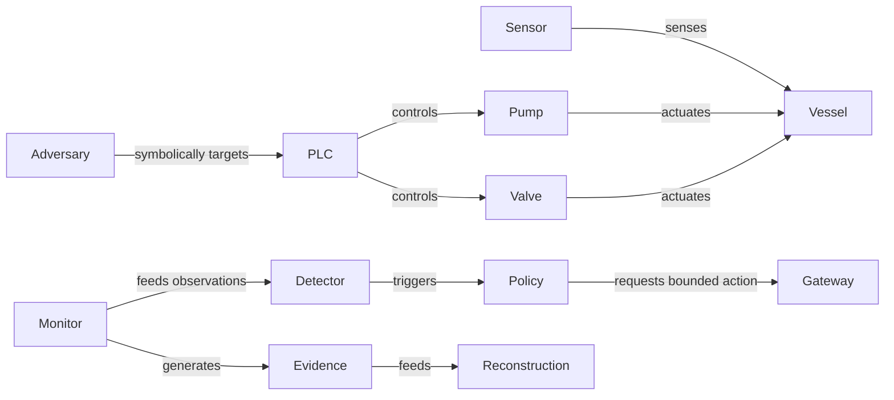

# UC3 entity-relationship projection

```mermaid
flowchart LR
  Sensor -->|senses| Vessel
  PLC -->|controls| Pump
  PLC -->|controls| Valve
  Pump -->|actuates| Vessel
  Valve -->|actuates| Vessel
  Adversary -->|symbolically targets| PLC
  Monitor -->|feeds observations| Detector
  Detector -->|triggers| Policy
  Policy -->|requests bounded action| Gateway
  Monitor -->|generates| Evidence
  Evidence -->|feeds| Reconstruction
```

This is a readable projection. Canonical nodes and edges are the entity JSON and relationship CSV; the graph JSON is generated.
