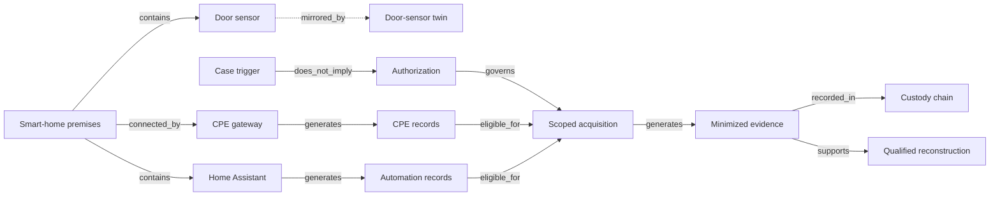

# UC4 entity-relationship view

```mermaid
flowchart LR
  P[Smart-home premises] -->|contains| D[Door sensor]
  P -->|contains| H[Home Assistant]
  P -->|connected_by| C[CPE gateway]
  D -. mirrored_by .-> DT[Door-sensor twin]
  C -->|generates| CR[CPE records]
  H -->|generates| HR[Automation records]
  A[Case trigger] -->|does_not_imply| AU[Authorization]
  AU -->|governs| AC[Scoped acquisition]
  CR -->|eligible_for| AC
  HR -->|eligible_for| AC
  AC -->|generates| E[Minimized evidence]
  E -->|recorded_in| CU[Custody chain]
  E -->|supports| R[Qualified reconstruction]
```

The diagram is explanatory. Canonical entities/relations and the generated graph remain authoritative; case existence and authorization are intentionally separate.
