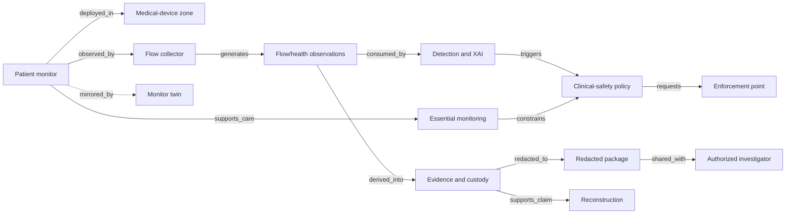

# UC5 entity-relationship view

```mermaid
flowchart LR
  M[Patient monitor] -->|deployed_in| Z[Medical-device zone]
  M -->|observed_by| C[Flow collector]
  M -->|supports_care| Care[Essential monitoring]
  M -. mirrored_by .-> T[Monitor twin]
  C -->|generates| O[Flow/health observations]
  O -->|consumed_by| X[Detection and XAI]
  X -->|triggers| S[Clinical-safety policy]
  Care -->|constrains| S
  S -->|requests| E[Enforcement point]
  O -->|derived_into| V[Evidence and custody]
  V -->|redacted_to| R[Redacted package]
  R -->|shared_with| I[Authorized investigator]
  V -->|supports_claim| Q[Reconstruction]
```

This is a readable projection. The relationship CSV is authoritative and the generated graph contains the validated static/runtime lineage.
